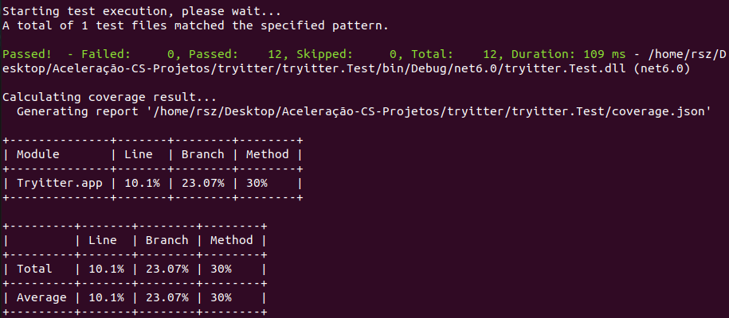

  <h3 align="center">Desafio Final da Aceleração em C# da Turma XP - Trybe</h3>
  

    Trata-se de desafio técnico proposto ao final da Aceleração em C# da Turma XP - Trybe, no qual foi desenvolvido um aplicativo de rede social, o Tryitter.
  

## Sumário

<ol>
  <li>
    <a href="#1-sobre-o-desafio">Sobre o desafio</a>
  </li>
  <li>
    <a href="#2-explicação-sobre-as-tomadas-de-decisão-no-projeto">Explicação sobre as tomadas de decisão no projeto</a>
  </li>
  <li>
    <a href="#3-instruções-sobre-como-executar-o-projeto">Instruções sobre como executar o projeto</a>
  </li>
  <li>
    <a href="#4-contato">Contato</a>
  </li>
</ol>

## 1. Sobre o desafio

Foi realizado o desafio de Tema 1 - Tryitter.

Trata-se de uma rede social em que as pessoas estudantes poderão, por meio de textos e imagens, compartilhar experiências e aprendizados.

O desafio é composto dos seguintes requisitos técnicos:

- Utilizar C#, SQL Server e Azure;
- Ter rotas autenticadas e rotas anônimas;
- Utilizar os frameworks xUnit e FluentAssertions para criar testes;
- Implementar um CRUD para as contas de pessoas estudantes;
- Implementar um CRUD para um post de uma pessoa estudante; e
- 30%, no mínimo, de cobertura de testes.

## 2. Explicação sobre as tomadas de decisão no projeto

Seguem as decisões tomadas no planejamento e na implementação do projeto, com a correspondente explicação.

### I) Etapa de planejamento

Nesta etapa foram definidos os endpoints e também foi confecionada a versão inicial deste README.

Seguem as definições com as justificativas.

#### Endpoints

Para orientar o desenvolvimento dos endpoints, foi elaborada a lista a seguir:

- POST /account
- POST /login
- GET /account/{accountId}
- GET /account
- PUT /account/{accountId}
- DELETE /account/{accountId}
- POST /post
- GET /post/account/{accountId}
- GET /post/{postId}
- PUT /post/{postId}
- DELETE /post/{postId}

### II) Etapa de implementação

Na etapa de implementação, foram elaborados os endpoints com os requisitos especificados.

Seguem os endpoints implementados:

#### POST /account

O endpoint cria uma nova conta na rede social.

Recebe como entradas os dados da conta da pessoa estudante na rede social.

Retorna os dados da nova conta.

#### POST /login

O endpoint se destina à autenticação e autorização.

Recebe como entrada os dados da conta do estudante.

Retorna um token.

#### GET /account/{accountId}

O endpoint retorna os dados da conta da pessoa estudante na rede social.

Recebe como entrada o id da conta.

#### PUT /account/{accountId}

O endpoint altera os dados da conta da pessoa estudante na rede social.

Recebe como entradas o id da conta e os novos dados.

Retorna os novos dados.

#### DELETE /account/{accountId}

O endpoint remove uma conta na rede social.

Recebe como entrada o id da conta.

#### POST /post

O endpoint cria um post na conta indicada.

Recebe como entradas o id da conta e os dados do post.

Retorna os dados do post.

#### GET /post/account/{accountId}

O endpoint lista todos os posts de uma pessoa estudante na rede social.

Recebe como entrada o id da conta.

Retorna uma lista com os dados dos posts.

#### GET /post/{postId}

Retorna os dados de um post.

Recebe como entrada o id do post.

#### PUT /post/{postId}

O endpoint altera um post na rede social.

Recebe como entradas o id do post e os novos dados.

Retorna os novos dados.

#### DELETE /post/{postId}

O endpoint remove um post na rede social.

Recebe como entrada o id do post.

#### Apresentação

Seguem vídeos da API rodando localmente:

[gravacao_1.webm](https://user-images.githubusercontent.com/82423286/207754417-306f3c07-1956-4d9d-9ed7-daca02b3769e.webm)

[gravacao_2.webm](https://user-images.githubusercontent.com/82423286/207754434-17f51235-a65f-429e-90e1-81804c6229e0.webm)

[gravacao_3.webm](https://user-images.githubusercontent.com/82423286/207754443-9b0c5a1a-cd50-4c5c-8d00-2daf5dbac3ae.webm)

No Swagger:

https://user-images.githubusercontent.com/82423286/207754345-b32b9228-cd9e-4cab-ab7d-0f13137856f4.mp4

https://user-images.githubusercontent.com/82423286/207754370-8d17ffe9-4087-4c03-b9c6-a1d92c4db1c7.mp4

https://user-images.githubusercontent.com/82423286/207754395-3879783e-82e9-45e7-9e89-318f57baf047.mp4

#### Testes

O projeto conta com testes para garantir a qualidade e o funcionamento do código.

Atualmente, todos os testes estão sendo executados com êxito, conforme pode ser observado abaixo.

Além disso, os testes possuem atualmente cobertura de código de `30%`.

  

#### Deploy da API

Foi feito o deploy da API, que pode ser encontrada na URL abaixo:

https://tryitter-iwr.azurewebsites.net/

Com Swagger:

https://tryitter-iwr.azurewebsites.net/swagger/index.html

Em razão das limitações da versão gratuita da conta do Azure, a API pode não estar disponível no momento da consulta.

Sendo assim, deixamos um vídeo da API no momento do deploy:

https://user-images.githubusercontent.com/82423286/207754460-0de64864-a771-4d51-b30a-d655ce33cc68.mp4

## 3. Instruções sobre como executar o projeto

- Inserir a sua senha do SQL Server no Context
- Verificar se o SQL Server está ativo (por exemplo, com o comando systemctl status mssql-server –no-pager)
- Fazer o update das migrations (por meio do comando dotnet ef database update)
- Executar o comando dotnet run na pasta Tryitter.app
- Por fim, abrir o localhost no navegador (para utilizar o Swagger, adicionar na URL /swagger/index.html)
- Para testar a API, executar o comando dotnet test na pasta Tryitter.test

## 4. Contato

Ingrid Mattos

  

 

Wilk Morais

  

 

Rhenan Stocco Zimmermann

  

 

<a href="#sumário">🔝 Voltar ao topo</a>
